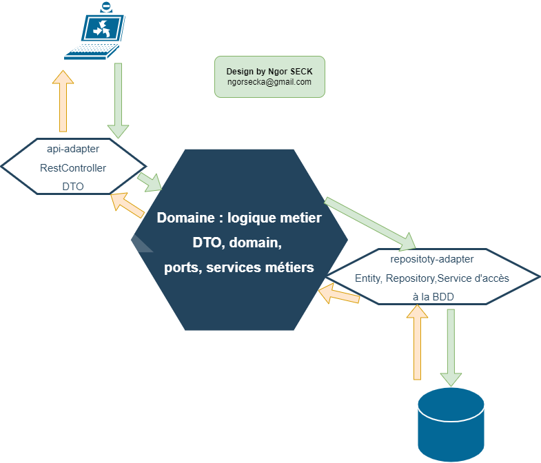
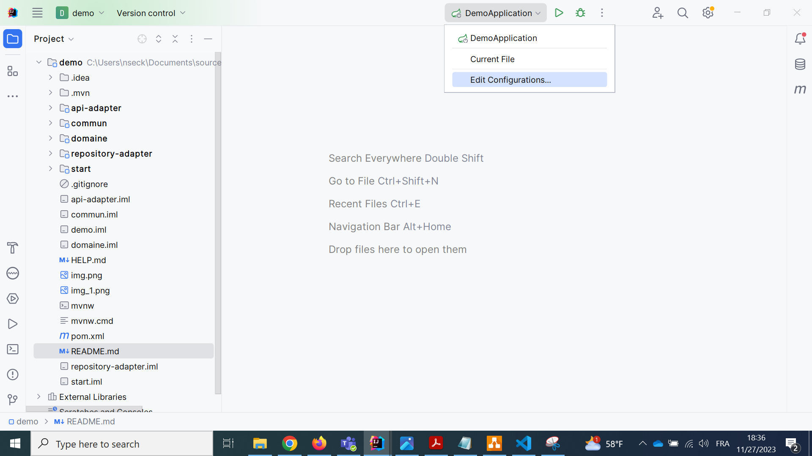
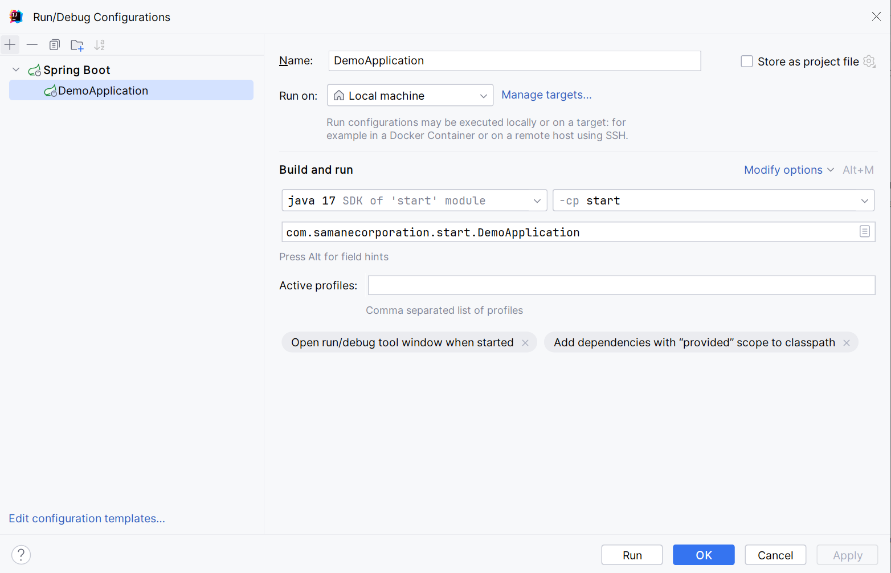
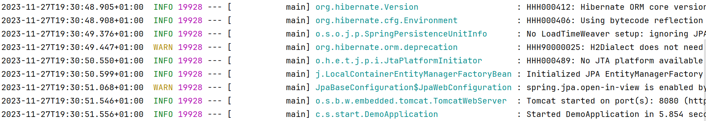
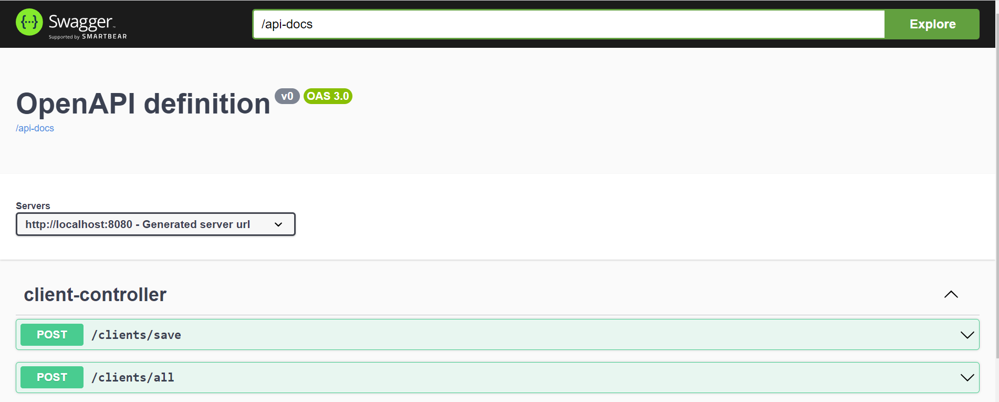

 
 


# Documentation

Ce projet vous montre comment mettre en place une architecure hexagonal avec un projet spring boot piloter par maven.



## Configuration du projet

J'ai d'abord créé un projet spring boot de base. Puis j'ai ajouté quatre modules:

>***commun*** pour les DTO

>***domaine*** qui définie les mappers entre domaine et DTO, les modeles du domaine, les ports (en entréé pour le web et en sortie vers la base de données) plus les services.

>Et pour les connexions au port, nous avons deux autres modules à savoir ***api-adapter*** pour les controllers et ***repository-adapter*** pour la base de données.


## Installation

Juste cloner le projet puis faite un clean install, toutes les configurations de base dont déjà faite (openapi, h2)

```bash
git clone https://github.com/ngorseck/hexagonal.git

cd hexagonal/demo/

mvn clean install
```


## Execution

Juste ouvrir avec votre IDE puis ajouter cette configuration :



Puis 



En fin cliquer sur apply 

Démarrer le projet




## Usage

Et pour lancer le projet avec le port 8080 puis visualisation des endpoints puis test :

```bash
http://localhost:8080/swagger-ui/index.html
```
